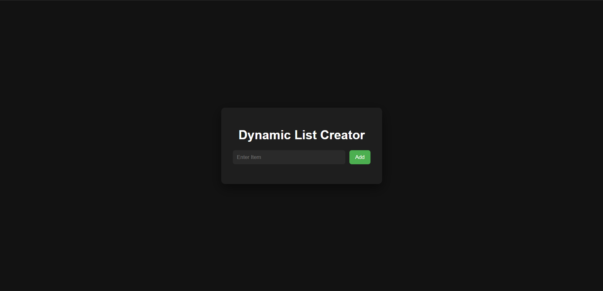
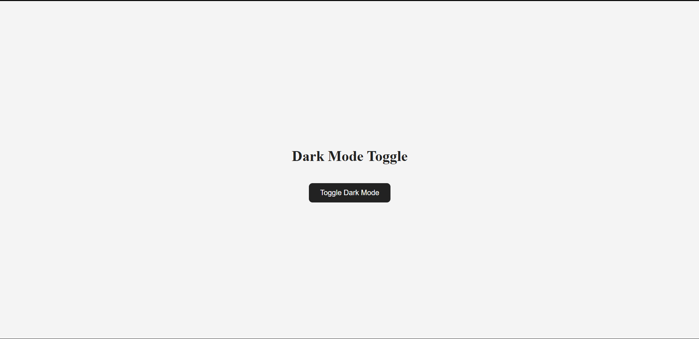
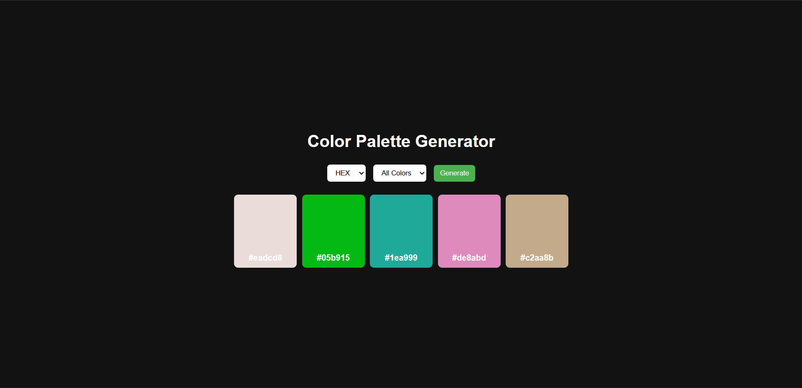
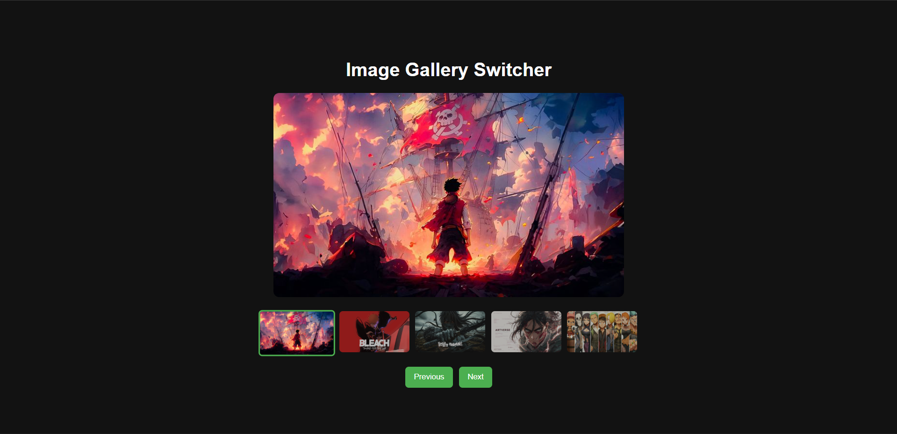

# JavaScript Mini Projects

A collection of small JavaScript projects built while learning DOM manipulation and strengthening core JavaScript concepts.

## Projects

### 1. Dynamic List Creator

Features:

- Add items
- Edit items with double click
- Delete items
- Keyboard support (Enter key)

---

### 2. Dark Mode Toggle

Features:

- Toggle light/dark theme
- Uses classList.toggle()

---

### 3. Color Palette Generator

Features:

- Generates random colors
- Built using JavaScript and DOM manipulation

---

### 4. API Data Fetch (User List Viewer)

Features:

- Fetches user data from an API
- Handles loading, success, and error states
- Displays user list dynamically
- Shows "No users found" for empty responses
- Retry option on failure
- Button disabled during loading

Concepts Practiced:

- Fetch API & Promises
- Async data handling
- State-driven UI rendering
- Separation of concerns (state, logic, UI)

---

### 5. Image Gallery Switcher

Features:

- Click thumbnails to switch main image
- Next/Previous navigation
- Wrap-around logic for seamless cycling
- Active thumbnail highlighting

Concepts Practiced:

- DOM manipulation
- Event handling
- State management using index
- Synchronizing UI with state
